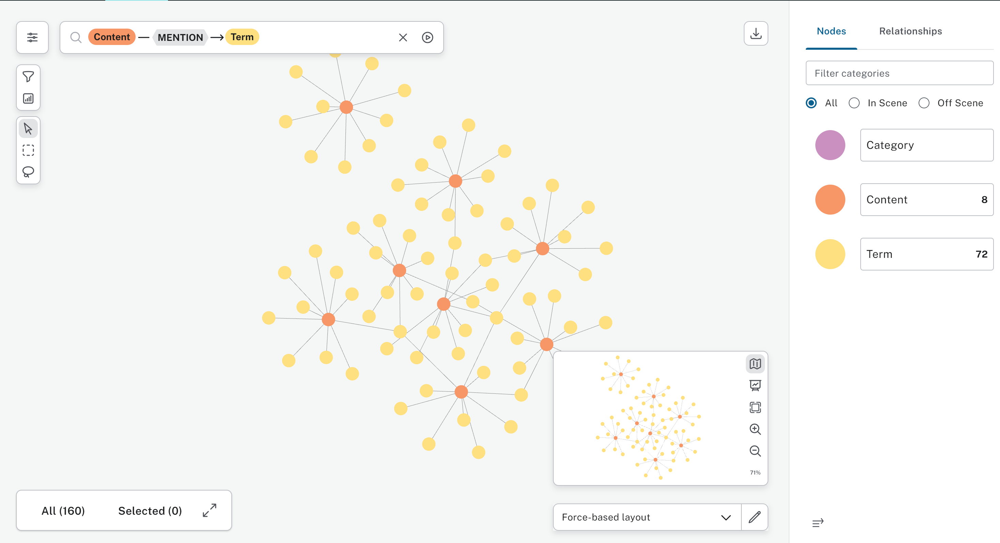

# Information Retrieval Graph

Updated: 2024.09.17

Create an information retrieval system that who effectiveness as retrieving information can be measured.

This project will be a graph-based information retrieval system that uses Neo4J, Python, and the Natural Language Toolkit (NLTK) to map content and retrieve information. The system will focus on measuring performance using an F-score. You can find my explanation of the project and its progress for the [Hackathon 2024](docs/infromation-retrival-graph-hackathon2024.md).

## Work on pattern mining discovery using a graph



This exercises will load a list of repositories and crawl the repo to find 'toc.yml' objects. It then feeds each toc.yml file to a function that graphs the function. A routine then produces cypher files that can be loaded into Neo4j.

### Some notes

The output of the graphing section is format agnostic, and could accommodate different graph formats.

### Project dependencies

**markdownvalidator**: https://github.com/mattbriggs/markdown-validator. I am using this as a local package. 

### Working notes

My notes:

1. Load the toc as a dictionary.
2. Iterate over each level.
3. At each level that is a list/array,
4. Unpack the dictionaries, grab the markdown file, get the content-type and add to the dictionary.

We may need a service that categories the content by possible content type based on the rules.

 - https://neo4j.com/docs/python-manual/current/get-started/
 - http://localhost:7474/browser/

### How to use instructions (rough)

The system starts with: `tocgrapher.py`

1. Update `jobtoc.yml` with the repos.
   Here is the following example of the jobtoc.yml.
    
    ```yml
    output: "C:\\data\\tocgraphs\\"
    type: "neo4j"
    limit: 1000
    folders:
      - folder: "C:\\git\\ms\\azure-docs-pr\\articles\\"
    ```

    | Property | Value | Description |
    | --- | --- | --- |
    | output | file path (escaped virgule) | Output directory where the logs will be stored or with formats with an output, where the outputs will be placed. |
    | type | Enum | `neo4j` : will connect to a Neo4J graph database and load the graph.<br>`csv`: Qill drop each toc graph as a node/edge pair of files into the output folder. |
    | limit | number | Limits the number of TOCs. Nothing will happen if you type 0. |
    | folders | array | a list of file path (escaped virgule)s to repositories to scan for` toc.ymls`. |
2. Update `fowler.yml` with Neo4J credentials.
    Here is the following example of the `fowler.yml`.
      ```yml
      ---
      username: <username>
      password: <token>
      domain: <neo url>
      ```
3. Type:
    ```python
    tocgrapher.py
    ```
4. Type:
    ```python
    tockeywords.py
    ```
5. Type:
    ```python
    toctaxonomy.py
    ```
6. 5. Type:
    ```python
    tocfscoretest.py
    ```

### Explanation of tocgrapher

This script builds a graph from a list of GitHub repositories that use the DocFX/Learn.microsoft.com content type. The program loads a configuration file, counts the number of YAML files, and parses each TOC (table of contents) file and the content associated with it. It then writes the resulting graph to a cypher database or outputs graph formats to a specified file.

The script contains the following functions:

1. `get_split(innumber)` - This function takes a number as input and splits it into four ranges, returning a list of tuples representing the start and end indices of each range.

2. `parse_toc_block(index_start, index_end, outtype, outputpath)` - This function takes a segment of the TOC as input and processes each item in the segment, creating a graph in either the neo4j or csv format based on the value of the `outtype` parameter. If the output type is neo4j, the resulting graph is written to a Cypher file with the current date and a count appended to the filename. If the output type is csv, the function creates a CSV file with the same naming convention and checks that the output is valid.

3. `main()` - This function is the main entry point of the program. It reads the configuration file specified in the script, gets the TOCs from each repository, and sets a limit on the number of TOCs to process if specified in the configuration file. The `TOCLIST` global variable is then set to a subset of the TOCs based on the limit. If the length of `TOCLIST` is less than 8, `parse_toc_block` is called with the full range of indices. Otherwise, the function splits the indices into four ranges using `get_split` and creates four threads to process each range in parallel using `parse_toc_block`.

The script also contains the following global variables:

1. `TODAYSDATE` - A `datetime` object representing the current date.

2. `TOCLIST` - An empty list that is later filled with TOC paths.

Finally, the script checks if it is being run as the main program using the `if __name__ == "__main__":` block and calls `main()` if it is.

### Explanation of tocscanner

The script defines a function `input_tocfile` that takes a YAML file representing a table of contents as input and returns a tuple of two lists. The first list contains dictionaries representing nodes in a graph, and the second list contains dictionaries representing edges in the graph.

The `input_tocfile` function reads the YAML file and creates a root node for the graph. It then recursively processes the YAML file to build a graph object as a tuple of edges and nodes. Each tuple is an array of dictionaries specifying the node and the edge. The nodes represent content and TOC entries, while the edges represent the relationship between them. The resulting graph can be used for various purposes, such as generating a navigation menu for a website.

The script also includes some utility functions, such as `make_set` to convert an iterable to a set and `escape_text` to escape characters that throw issues in Cypher.

The `main` function is empty and is not used in the script. The script can be run as a standalone program or used as a module by importing the `input_tocfile` function.

### Explanation of tocharvester

This is a Python script that defines two functions. 

The first function is called `get_files()` and takes a single argument `inpath`. This function takes a directory path as input and returns a list of file paths for all `.yml` files in the directory and its subdirectories. The `os.walk()` function is used to recursively traverse the directory tree, and for each file encountered, the function checks if the file has a `.yml` extension, and if so, adds its path to the output list. The function returns the list of file paths.

The second function is called `get_tocs_from_repo()` and takes a single argument `pathtorepo`. This function takes a path to a repository as input and returns a list of paths to all `toc.yml` files in the repository and its subdirectories. This function first calls the `get_files()` function with the `pathtorepo` argument to obtain a list of all YAML files in the repository. It then checks each file path in the list to see if it contains the substring "toc.yml" (case-insensitive), and if so, adds it to a list of `toc.yml` file paths. The function returns the list of `toc.yml` file paths.

The script has a header comment that gives the script name and the date and author of the last modification. The script imports the `os` module, which provides a way to interact with the file system.

## tocformats

This script generates output files (in various formats) based on input graph data in the form of a tuple of two arrays of dictionaries describing nodes and edges. The script currently supports the following output formats: 

1. cypher (Neo4j)
2. gremlin (CosmoDB)
3. graphml (Gelphi/yEd)
4. dot (GraphViz)

The input data is parsed to create and execute cypher queries, which create nodes and edges in a Neo4j database, and output text files for gremlin, graphml, and dot formats. It also supports creating CSV files.

The script defines a `Neo4jDB` class that has methods to create and close a database connection, and another method to execute a given Cypher query to add nodes and edges. There are several functions that create and return output for different formats, such as `create_cypher_graph()` that generates cypher queries for nodes and edges, `create_gremlin_text()` that creates gremlin queries for nodes and edges, `create_graphml_text()` that creates graphml format, and `create_dot_text()` that creates dot format.

There are also several helper functions, such as `make_attribute()` that returns a formatted string with attributes to use when creating a node, `create_cypher_nodes()` that creates a cypher query for a node, `create_cypher_edges()` that creates a cypher query for an edge, `create_gremlin_nodes()` that creates a gremlin query for a node, and so on. 

The script seems to have some issues as well, such as the `create_gremlin_text()` function is calling `create_cypher_nodes()` and `create_cypher_edges()` instead of creating gremlin queries. There are also some incomplete function names, such as `make_table()` and `make...`.

Create an information retrieval system that who effectiveness as retrieving information can be measured.

## Note on keys

Here's an example of what the file that contains keys file might look like, including the necessary keys for Neo4j credentials, OpenAI API key, and content context:

```yaml
# Neo4j Credentials
domain: bolt://localhost:7687
username: neo4j
password: your-neo4j-password

# OpenAI API Key
openai-key: your-openai-api-key

# Content context
content: "an Azure billing service for Microsoft."

# Root node name
rootnode: "Root node name"
```

### Breakdown:
1. **Neo4j Credentials**:
   - `domain`: Specifies the connection string to your Neo4j database.
   - `username`: Your Neo4j username.
   - `password`: Your Neo4j password.

2. **OpenAI API Key**:
   - `openai-key`: The key you use to authenticate OpenAI's API.

3. **Content**:
   - `content`: The specific context related to the subject domain (e.g., in this case, an Azure billing service for Microsoft). This will be used in the prompt to OpenAI GPT-4 to help generate more contextually appropriate category names. 
4. **Root Node Name**:
   - `rootnode`: The name of the root node in the graph.

Make sure to replace the placeholders (`your-neo4j-password`, `your-openai-api-key`) with your actual credentials and content description.