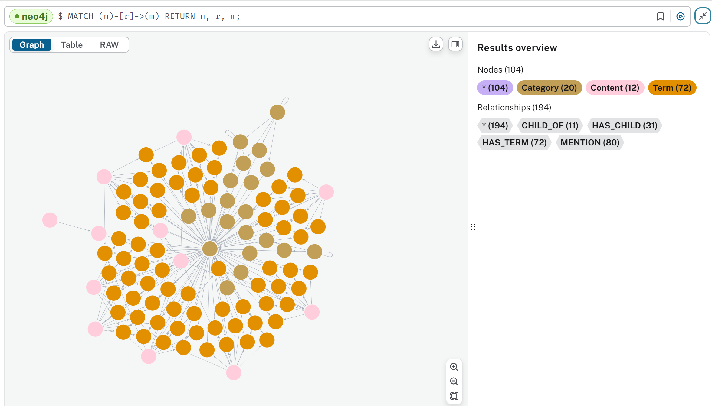

# Hackathon 2024

_Information Retrieval Graph_

I'll be presenting the project I worked on—an information retrieval graph that uses Neo4J, Python, and the Natural Language Toolkit (NLTK) to map content and retrieve information, with an emphasis on measuring performance using an F-score.

This graph serves two key purposes:

1.  **Mapping content structure**: This component is based on the table of contents and articles associated with it.

2.  **Creating a semantic map**: The goal here is to allow for enhanced information retrieval by connecting and categorizing key terminology within the articles.

**Building the Graph**

To construct this graph, I developed a Python script that processes a markdown repository built for **DocFx**—a static site generator for technical documentation. Each markdown file follows a specific format, consisting of a **YAML header** (which stores metadata) and a **markdown body** (which contains the actual content).

The content in the markdown body is unstructured, meaning it's primarily designed for human-readable HTML, with minimal semantic meaning. Unstructured content like this poses challenges for information retrieval, as it lacks the metadata needed for machines to fully understand the relationships within the text.

**Extracting Metadata and Summarizing Content**

The first step in the process was to extract information from the YAML header. This header includes useful metadata, such as the title, author, and tags. For the markdown body, I implemented a summarization algorithm that identifies the most prominent terms based on **word frequency**. This technique, while not AI-driven, is grounded in statistical analysis, specifically frequency distribution—a method that evaluates how often specific terms appear within a text.

By identifying the most frequent terms, we're able to create a reliable summary of the article, which helps in tagging and categorization. These summaries, however, are not enough for deep information retrieval, which brings us to the next part of the process.

**Entity Extraction Using NLTK**

To dive deeper into the content, I used **NLTK**, or the Natural Language Toolkit, which is a Python library widely used for text processing. NLTK allows us to apply **natural language processing (NLP)** techniques, specifically for **entity extraction**. This step focuses on identifying and extracting **nouns and noun phrases**—the key entities that define what each article is truly about.

By processing the raw text, NLTK can parse the content and apply a **statistical model** to extract and rank the most significant terms within the article. For each article, we identified the top 10 terms, which were then stored alongside the summary.

**Creating the Graph with Neo4J**

Once I had the key terms and summaries for each article, I created a **graph database** using **Neo4J**, a powerful tool for representing relationships between entities. In Neo4J, content, terms, and categories are represented as **nodes** in a graph. Relationships between these nodes, such as **"MENTION"**, help us model how terms connect to specific articles.

This structure allows us to perform **information retrieval** tasks, such as identifying articles related to a specific term or finding associations between articles through shared categories or terms.

I also used **unsupervised clustering** to group similar terms and create categories. Clustering was implemented using **scikit-learn**, a machine learning library, to identify **semantic similarities** between terms. As a result, the graph ended up with 20 categories, along with a few supercategories.

**Scoring Information Retrieval with F-Score**

The effectiveness of this system is measured using the **F-score**, which is a metric used in information retrieval to evaluate performance. The F-score is calculated based on **precision** (the accuracy of retrieved results) and **recall** (the ability to retrieve all relevant items). The F-score helps us balance these two factors to assess the overall quality of the retrieval process.

In our case, the graph was tested with pre-configured queries, and the F-scores ranged from **0.67** for one term, indicating moderate retrieval accuracy, to **1.0** for another term, which means perfect retrieval accuracy for that query.

**Next Steps**

While the results so far are promising, the naming of the categories could be refined further to improve the clarity of the clusters. This could enhance the user experience when navigating through the graph or searching for specific content. Additionally, I aim to optimize the algorithm to improve semantic understanding of the categories.

**Conclusion**

In summary, this project showcases how combining tools like **Neo4J**, **Python**, **NLTK**, and statistical models can effectively structure and retrieve unstructured content, creating a powerful information retrieval system. The use of the F-score allows us to rigorously assess the system's performance, ensuring that it meets the desired standards for accuracy and relevance.
